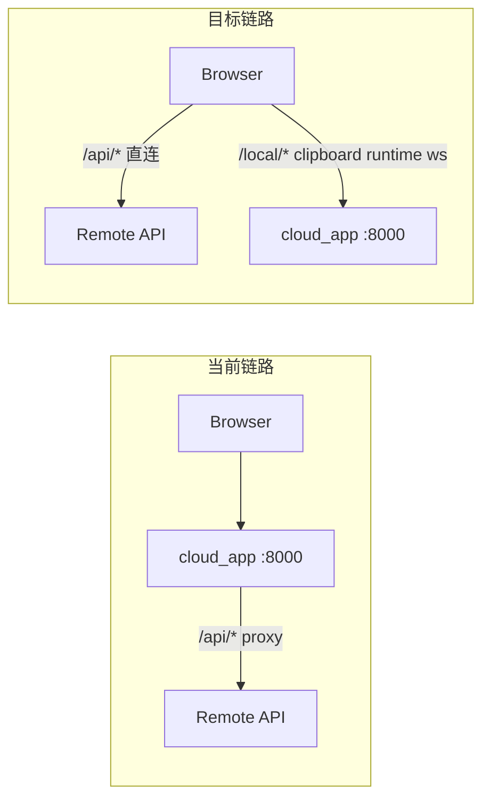

# 云模式双向路径重构计划

## 现状与目标



| 组件 | 当前 | 目标 |
|------|------|------|
| 业务 `/api/*` | [`cloud_app.py`](cloud_app.py) `proxy_api` 转发 | 浏览器直连 `cloudApiBaseUrl` |
| 鉴权 token | 代理自动注入 `X-Remote-Access-Token` | 前端从 `GET /local/credentials` 读取并逐请求注入 |
| 剪贴板 / 配置 / 更新 | 部分本地、runtime 经代理 | 全部走本地 cloud_app |

---

## 1. 后端：[`cloud_app.py`](cloud_app.py)

### 1.1 删除业务代理

移除以下内容（约 L35–49、L101–117、L186–220）：

- `HOP_BY_HOP_HEADERS` / `_forward_headers` / `_response_headers`
- `@app.api_route("/api/{path:path}")` 的 `proxy_api`
- `import httpx`（若无其他引用）

**兼容未配置场景**：不再由本地返回 428；改由前端在发起业务请求前检测 `configured`（见第 2 节）。保留 `POST /local/config/test` 的 428 行为不变。

### 1.2 新增本地-only 端点

**`GET /local/credentials`**（用户选定独立端点）：

```python
class LocalCredentialsPayload(BaseModel):
    remoteAccessToken: str | None
    cloudApiBaseUrl: str | None
    configured: bool
```

- 从 `load_config()` 读取，**返回明文 `remoteAccessToken`**（供前端挂 header）
- **仅注册在 cloud_app**，[`api.py`](api.py) 不添加此路由
- `GET /local/config` 保持现有行为（仅 `remoteAccessTokenConfigured` 布尔值，不含明文）

**`GET/POST /api/runtime/*`**：从 [`api.py`](api.py) L1295–1307 复制同等路由，委托 [`updater_runtime.py`](updater_runtime.py)（当前 cloud 模式下 runtime 被误代理到远端，改造后应本地化）。

### 1.3 保持不变

- `install_remote_access(app)` — 保护本地 UI 与非 loopback 访问
- `POST /api/clipboard/ignore`、`WebSocket /ws/clipboard`
- `GET/PUT /local/config`、`POST /local/config/test`
- [`frontend_static.py`](frontend_static.py) 静态资源挂载

---

## 2. 前端：统一请求分发 — [`web/src/lib/api.ts`](web/src/lib/api.ts)

### 2.1 核心抽象

```typescript
type RequestTarget = "local" | "remote";

const LOCAL_ONLY_PREFIXES = [
  "/local/",
  "/api/clipboard/ignore",
  "/api/runtime/",
];

function resolveRequestTarget(path: string): RequestTarget { ... }

async function resolveRequestBase(path: string): Promise<string> { ... }
```

**基址决策链**（仅 `target === "remote"` 时）：

1. `process.env.NEXT_PUBLIC_API_BASE_URL`（去尾 `/`）
2. `GET /local/credentials` 的 `cloudApiBaseUrl`
3. 兜底 `""`（同源）— 对应 **本地完整服务模式**（`app.py`，`fetchLocalConfig()` 返回 `null`）

**本地基址**：默认 `""`（同源）；可选 `NEXT_PUBLIC_LOCAL_API_BASE_URL` 覆盖（与 spec 中 `127.0.0.1:8000` 场景一致）。

### 2.2 凭证缓存与 header 注入

在 [`web/src/lib/local-config.ts`](web/src/lib/local-config.ts) 新增：

```typescript
export interface LocalCredentialsPayload {
  remoteAccessToken: string | null;
  cloudApiBaseUrl: string | null;
  configured: boolean;
}
export function fetchLocalCredentials(): Promise<LocalCredentialsPayload | null>;
export function invalidateLocalCredentialsCache(): void;
```

[`api.ts`](web/src/lib/api.ts) 内：

- 模块级 cache（credentials + 是否 cloud client）
- `requestJson` 改造：`const url = await resolveRequestUrl(path)`
- 远端请求且 token 存在时：附加 `X-Remote-Access-Token`
- **Cloud 模式 + 未配置**：在 `resolveRequestUrl` 内直接 `throw new Error("请先配置数据库服务地址")`（等价原 428，不发起网络请求）
- **`ignoreClipboardText` 强制 local**：即使其他 API 走远端，`/api/clipboard/ignore` 必须走本地基址（防止回填环路）

[`web/src/app/settings/page.tsx`](web/src/app/settings/page.tsx)：`saveLocalConfig` 成功后调用 `invalidateLocalCredentialsCache()`。

### 2.3 WebSocket — [`web/src/lib/ws.ts`](web/src/lib/ws.ts)

保持现有逻辑（默认同源 `/ws/clipboard`）；已有 `NEXT_PUBLIC_WS_URL` 覆盖。补充注释说明：UI 经非 localhost 域名访问时，可设 `NEXT_PUBLIC_WS_URL=ws://127.0.0.1:8000/ws/clipboard` 强制连本地监听进程。

---

## 3. 远端 CORS（必要配套）

浏览器从 `http://127.0.0.1:8000`（cloud 壳）跨域请求远端 API 时，[`api.py`](api.py) 当前 CORS 仅允许 `:3000` dev 源，**直连会触发 CORS 失败**。

在 [`api.py`](api.py) 扩展 `allow_origins`：

```python
_default = [
    "http://localhost:3000", "http://127.0.0.1:3000",
    "http://localhost:8000", "http://127.0.0.1:8000",
]
# + os.getenv("CORS_ALLOW_ORIGINS", "").split(",") 过滤空项
```

[`README.md`](README.md) 补充：Cloud 直连模式下，若从局域网 IP 访问 cloud 壳（如 `http://192.168.x.x:8000`），远端服务器需将该 origin 加入 `CORS_ALLOW_ORIGINS`。

---

## 4. 测试变更

### 后端 — [`test_cloud_app.py`](test_cloud_app.py)

| 操作 | 说明 |
|------|------|
| **删除/替换** | `test_cloud_proxy_*` 共 5 个用例 |
| **新增** | `GET /api/dashboard` → **404**（无代理） |
| **新增** | `GET /local/credentials` 返回 token/url/configured；响应不含于 `/local/config` |
| **新增** | `/api/runtime/update-status` 本地响应，不触网 |
| **保留** | `test_cloud_clipboard_ignore_is_local`、local config 系列 |

[`test_verification.py`](test_verification.py) 中注册的 cloud proxy 用例名同步更新。

### 前端

| 文件 | 新增用例 |
|------|----------|
| [`web/src/lib/api.test.ts`](web/src/lib/api.test.ts) | 配置 cloud URL 时 `/api/dashboard` 请求远端基址 + token header；`/api/clipboard/ignore` 始终本地；未配置 cloud 时 `fetchDashboard` 抛 428 文案 |
| [`web/src/lib/local-config.test.ts`](web/src/lib/local-config.test.ts) | `fetchLocalCredentials` 404→null、正常 payload |
| [`web/src/lib/ws.test.ts`](web/src/lib/ws.test.ts) | `getClipboardWsUrl` env/SSR/浏览器三分支 |

建议将 `resolveRequestTarget` / `resolveRequestBase` **export 供测试**，或抽到 [`web/src/lib/request-routing.ts`](web/src/lib/request-routing.ts) 独立模块便于单测。

---

## 5. 文档

[`README.md`](README.md) Cloud 客户端章节更新：

- 业务 API 不再经本地代理；latency 降为浏览器→远端一跳
- 远端需配置 CORS（含 `CORS_ALLOW_ORIGINS`）
- 删除「Cloud 客户端会将 `/api/...` 代理到远端」表述
- 保留 Nginx PUT/PATCH/DELETE 说明（针对远端部署）

---

## 6. 回归检查清单（手动）

- 未配置 cloud URL：Dashboard 等页面显示「请先配置数据库服务地址」
- 配置 + token 后：导入/出库/搜索/数据库组 PUT 正常
- 外部复制 → 剪贴板 WS 导入；`writeAppClipboardText` 后 ignore 仍走本地
- 远端 token 错误：401 + 现有中文提示
- 本地完整模式（`app.py`）：`fetchLocalConfig()` 为 null，全部同源，无回归

---

## 关键文件一览

| 文件 | 变更类型 |
|------|----------|
| [`cloud_app.py`](cloud_app.py) | 删 proxy；+credentials、runtime |
| [`api.py`](api.py) | CORS origins 扩展 |
| [`web/src/lib/api.ts`](web/src/lib/api.ts) | 分发层 + token 注入 |
| [`web/src/lib/local-config.ts`](web/src/lib/local-config.ts) | +credentials client |
| [`web/src/lib/ws.ts`](web/src/lib/ws.ts) | 注释/可选 env 说明 |
| [`web/src/app/settings/page.tsx`](web/src/app/settings/page.tsx) | cache 失效 |
| [`test_cloud_app.py`](test_cloud_app.py) | 代理测试→直连/本地测试 |
| [`web/src/lib/api.test.ts`](web/src/lib/api.test.ts) | 路由与鉴权单测 |
