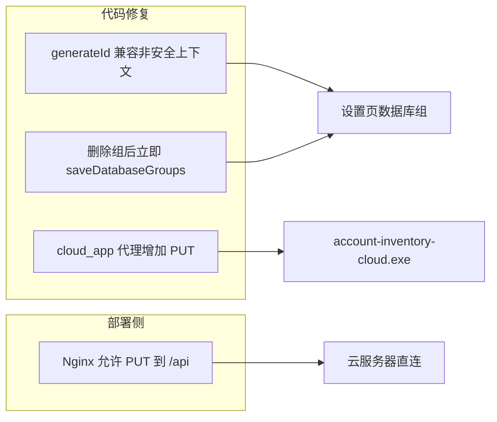

# 云部署数据库组三项修复

## 根因分析

### 1. `crypto.randomUUID is not a function`

[`web/src/app/settings/page.tsx`](web/src/app/settings/page.tsx) 在「新建组」时使用：

```280:284:web/src/app/settings/page.tsx
        id: crypto.randomUUID(),
        name: `组 ${nextIndex}`,
        databaseIds: [],
```

浏览器仅在**安全上下文**下提供 `crypto.randomUUID()`。常见差异：

| 访问方式 | 是否安全上下文 | randomUUID |
|---------|--------------|------------|
| `http://127.0.0.1:8000`（本地） | 是（localhost 例外） | 可用 |
| `http://<云服务器公网 IP>:8000` | 否 | 不可用 → 报错 |

因此本地 HTTP 正常、云服务器 HTTP 崩溃，并非矛盾，而是 **origin 不同**。

### 2. Cloud 客户端 `PUT .../api/database-groups` → 405

[`cloud_app.py`](cloud_app.py) 的 API 代理只允许：

```186:189:cloud_app.py
@app.api_route(
    "/api/{path:path}",
    methods=["GET", "POST", "PATCH", "DELETE", "OPTIONS"],
)
```

**未包含 `PUT`**，而 [`saveDatabaseGroups()`](web/src/lib/api.ts) 使用 `method: "PUT"`。FastAPI 对未注册方法返回 **405 Method Not Allowed**，与云端后端是否支持无关。

`/local/config` 的保存走 cloud_app 自身路由（`@app.put("/local/config")`），不受此 bug 影响；Cloud 客户端内「数据库服务地址」保存正常，**数据库组保存**才会 405。

### 3. 删除组「像摆设」

[`deleteDatabaseGroup()`](web/src/app/settings/page.tsx) 仅从 React state 移除组并设 `groupsDirty=true`，需再点「保存组配置」才调用 API。对比同页**分隔规则删除**（立即 `deleteSeparatorRule()`），用户感知为删除无效；若保存又因 405/randomUUID 失败，刷新后组会恢复。

你已选择：**删除后立即持久化**。

### 4. 直接访问云服务器地址时的保存失败（补充）

除上述 randomUUID 外，若云服务器前有 **Nginx/Caddy** 反向代理且未放行 `PUT`，`/api/database-groups` 也会 405。需在部署文档中补充代理配置（见 Step 4）。

---

## 修复方案



### Step 1：ID 生成兼容层

- 新建 [`web/src/lib/id.ts`](web/src/lib/id.ts)（或并入 [`web/src/lib/utils.ts`](web/src/lib/utils.ts)）：

```ts
export function generateId(): string {
  if (typeof crypto !== "undefined" && typeof crypto.randomUUID === "function") {
    return crypto.randomUUID();
  }
  return `id-${Date.now().toString(36)}-${Math.random().toString(36).slice(2, 10)}`;
}
```

- [`settings/page.tsx`](web/src/app/settings/page.tsx) 将 `crypto.randomUUID()` 替换为 `generateId()`。
- 可选：加 Vitest 用例 mock 无 `randomUUID` 环境。

### Step 2：Cloud 代理补齐 PUT

- [`cloud_app.py`](cloud_app.py)：`methods` 增加 `"PUT"`（建议改为 `["GET","POST","PUT","PATCH","DELETE","OPTIONS"]` 或 `"*"` 等价列表）。
- [`test_cloud_app.py`](test_cloud_app.py) 新增 `test_cloud_proxy_forwards_put_request`：
  - 配置 mock upstream
  - `client.put("/api/database-groups", json={...})`
  - 断言 upstream 收到 `PUT` 且 status 200

### Step 3：删除组立即持久化

修改 [`settings/page.tsx`](web/src/app/settings/page.tsx)：

- `deleteDatabaseGroup` 改为 `async`：
  1. 计算 `nextGroups = current.filter(...)`
  2. `setDatabaseGroups(nextGroups)`
  3. 立即 `await saveDatabaseGroups(nextGroups)`
  4. 成功：更新 state、`setGroupsDirty(false)`、`emitDatabaseChanged()`
  5. 失败：回滚 state 或 `refreshDatabaseGroups()` + 显示 `groupsError`
- 删除按钮增加 `disabled={savingGroups}`，删除中显示 loading。
- 「保存组配置」仍保留，用于新建/重命名/分配后的批量保存。

### Step 4：云服务器反向代理（部署说明，非必须改代码）

若使用 Nginx 反代 `app.py`，需允许 PUT（及 PATCH/DELETE）：

```nginx
location /api/ {
    proxy_pass http://127.0.0.1:8000;
    proxy_method $request_method;  # 或直接透传
    # 确保未 limit_except GET POST;
}
```

在 [`README.md`](README.md) 增加简短「云部署 / 反向代理」小节，说明 PUT 要求。

---

## 验证清单

| 场景 | 预期 |
|------|------|
| `http://<公网IP>/settings` 点击「新建组」 | 不再抛 `randomUUID` 异常 |
| Cloud exe → 保存组配置 | `PUT /api/database-groups` 200 |
| Cloud exe → 删除组 | 立即 PUT 成功，刷新后组不再出现 |
| `pytest test_cloud_app.py -k put` | 新增 PUT 转发测试通过 |
| `pytest test_verification.py` | 全量仍通过 |
| `npm run build`（web） | 通过 |

---

## 改动范围（聚焦）

| 文件 | 变更 |
|------|------|
| [`web/src/lib/id.ts`](web/src/lib/id.ts) | 新建 generateId |
| [`web/src/app/settings/page.tsx`](web/src/app/settings/page.tsx) | generateId + 删除组 auto-save |
| [`cloud_app.py`](cloud_app.py) | 代理 methods 加 PUT |
| [`test_cloud_app.py`](test_cloud_app.py) | PUT 转发回归测试 |
| [`README.md`](README.md) | 可选：Nginx PUT 说明 |

不改动数据库 schema、组校验逻辑、三源搜索 API。
