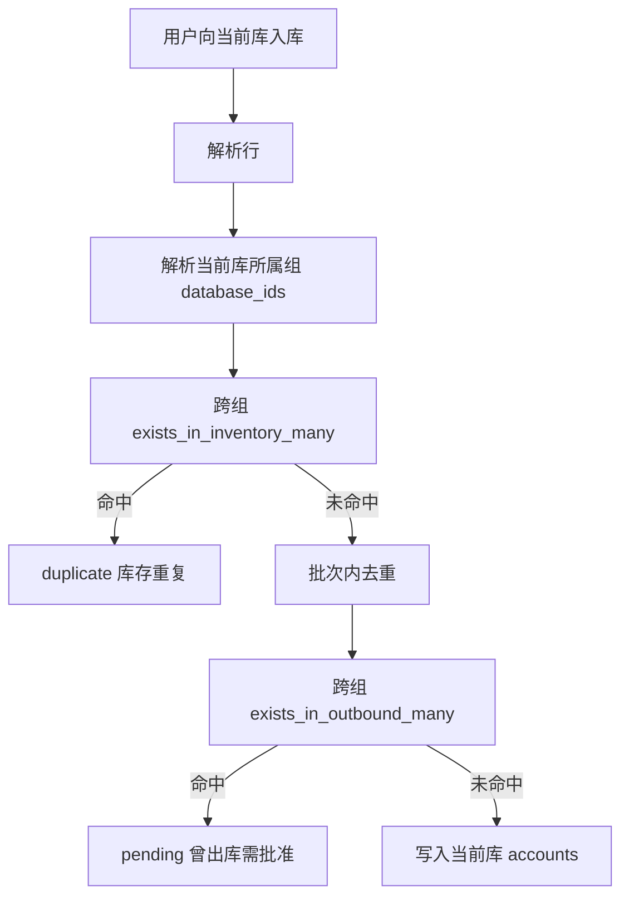
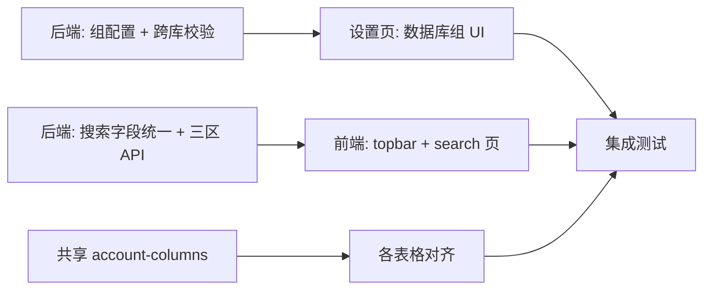

# 数据库组 + 前端表格/搜索统一 + 全局搜索三区划分

## 背景与现状

- **多库架构**：[`database.py`](database.py) 用 `data/databases.json` 注册多个 SQLite 文件，业务默认只连接**当前激活库**。
- **入库校验**：[`api.py`](api.py) 的 `_preview_rows_from_lines()` / `commit_inbound()` 仅调用单库的 `exists_in_inventory_many()`、`exists_in_outbound_many()`。
- **搜索不一致**：库存列表 [`_build_inventory_where()`](database.py) 只搜 `username/email/note`；全局/历史搜索用 6 字段（含 password、email_password、url）。
- **全局搜索混淆**：[`topbar.tsx`](web/src/components/layout/topbar.tsx) 将 `outbound_records` 标为「出库历史 / 历史」，与入库后的 `inbound_records` 概念混用；API 的 `source: "history"` 实际仅指出库记录。

---

## 一、数据库组（后端 + 设置页 + 入库校验）

### 1.1 数据模型

在 [`data/databases.json`](data/databases.json) 顶层新增 `database_groups`：

```json
{
  "active_database_id": "...",
  "databases": [...],
  "database_groups": [
    { "id": "uuid", "name": "组 A", "databaseIds": ["db1", "db3"] }
  ]
}
```

规则（你已确认）：
- **未分组的数据库**：仅与自身比对（向后兼容）。
- **已分组的数据库**：与同组内所有库比对；每个库最多属于一个组；保存时校验 ID 存在、组间不重叠。
- **删除数据库**：自动从组配置中移除该 ID。

### 1.2 后端 API

| 端点 | 作用 |
|------|------|
| `GET /api/database-groups` | 返回组列表 + 全部数据库（供设置页渲染） |
| `PUT /api/database-groups` | 保存完整组配置（原子替换） |

新增/扩展 [`database.py`](database.py) 函数：

```python
get_group_database_ids(database_id=None) -> list[str]
list_database_groups() / save_database_groups(groups)
exists_in_inventory_many_for_group(usernames, database_id=None) -> set[str]
exists_in_outbound_many_for_group(usernames, database_id=None) -> set[str]
get_latest_outbound_times_for_group(usernames, database_id=None) -> dict[str, str]
```

实现要点：根据组 ID 列表，对每个库文件调用 `_connect_to()` 后 union 查询结果（与现有 `_counts_for_record` 跨库模式一致）。

### 1.3 入库校验接入

替换以下位置的 `exists_in_*` 调用为 group 版本：

- [`api.py`](api.py) — `_preview_rows_from_lines()`、`commit_inbound()`
- [`cli.py`](cli.py) — CLI 入库流程（保持行为一致）

错误文案微调（可选但建议）：
- 重复：`账号 xxx 已在组内库存中`
- 曾出库：保持 pending 流程，但 `lastOutboundAt` 取组内各库 `MAX(outbound_at)`



### 1.4 设置页 UI

在 [`web/src/app/settings/page.tsx`](web/src/app/settings/page.tsx) 新增 **「数据库组」** Card（位于「当前数据库」下方）：

- 列出 [`fetchDatabases()`](web/src/lib/api.ts) 返回的全部库
- 支持创建/重命名/删除组，拖拽或多选将库分配到组
- 未分配库显示为「独立组（仅自身比对）」
- 保存调用 `PUT /api/database-groups`；保存后 `emitDatabaseChanged`

新增类型/API：[`web/src/types/account.ts`](web/src/types/account.ts)、[`web/src/lib/api.ts`](web/src/lib/api.ts)。

### 1.5 测试

在 [`test_verification.py`](test_verification.py) 增加：
- 两组各 2 库，向 A 组库入库时命中 B 组不拦截、同组拦截
- 未分组库仍仅比对自身
- 删除库后组配置自动清理

---

## 二、前端表格字段统一

### 2.1 标准字段集

抽取共享定义 [`web/src/lib/account-columns.ts`](web/src/lib/account-columns.ts)（新建）：

| 字段 | 键 | 渲染 |
|------|-----|------|
| 账号 | username | 文本 |
| 密码 | password | PasswordField |
| 邮箱 | email | PasswordField（与库存页一致） |
| 邮箱密码 | emailPassword | PasswordField |
| 网址 | url | 文本 |
| 备注 | note | 文本 / OutboundNoteField（出库场景） |
| 入库时间 | inboundAt | formatDateTime |
| 出库时间 | outboundAt | formatDateTime，无值显示 `—` |

**工作流专用列**（状态、确认、操作、#、选择框）保留在各表，不纳入标准集。

### 2.2 需对齐的文件

| 文件 | 当前缺失 |
|------|----------|
| [`HistoryTable.tsx`](web/src/components/history/HistoryTable.tsx) | url；邮箱应改为 PasswordField |
| [`inventory/page.tsx`](web/src/app/inventory/page.tsx) | 基本齐全，对齐渲染组件 |
| [`page.tsx`](web/src/app/page.tsx) FifoTable + 入库预览 | emailPassword、url、outboundAt |
| [`inbound/page.tsx`](web/src/app/inbound/page.tsx) | emailPassword |
| [`outbound/page.tsx`](web/src/app/outbound/page.tsx) | email、emailPassword、url、outboundAt |
| [`outbound-paste/page.tsx`](web/src/app/outbound-paste/page.tsx) | emailPassword、时间列 |
| [`search/page.tsx`](web/src/app/search/page.tsx) | 结果卡片需展示完整字段 |

可选：新建 [`AccountDataRow`](web/src/components/account/account-data-row.tsx) 减少重复 JSX。

---

## 三、搜索框实现统一

### 3.1 后端统一搜索字段

在 [`database.py`](database.py) 提取单一函数 `_account_text_search_clause()`（基于现有 [`_search_where_clause()`](database.py) 的 6 字段逻辑），供以下场景复用：

- `_build_inventory_where()` — **扩展**为 6 字段（当前仅 3 字段）
- `_history_text_clause()` — 改为调用共享函数（消除 `include_url=False` 分支差异）
- 全局搜索各表

统一 placeholder 文案（所有搜索框）：

> 搜索账号、密码、邮箱、网址、备注…

涉及：[`inventory/page.tsx`](web/src/app/inventory/page.tsx)、[`HistoryFilters.tsx`](web/src/components/history/HistoryFilters.tsx)、[`topbar.tsx`](web/src/components/layout/topbar.tsx)。

---

## 四、全局搜索三区划分

### 4.1 API 变更（Breaking）

[`GET /api/search`](api.py) 重构：

| 新区间 | 数据表 | 新 source 值 |
|--------|--------|--------------|
| 库存 | accounts | `inventory` |
| 出库 | outbound_records | `outbound`（原 `history`） |
| 历史 | inbound_records | `inbound` |

`SearchPayload` 字段：

```ts
inventoryTotal, outboundTotal, inboundTotal  // 替换 historyTotal
source: "all" | "inventory" | "outbound" | "inbound"
```

`SearchResult.source` 同步三分；`account` 类型分别为 `Account` / `OutboundRecord` / `InboundRecord`。

新增 [`database.py`](database.py)：

- `count_search_inbound_history()` / `search_inbound_history()` — 查 `inbound_records`，字段与 outbound 搜索对齐

`source=all` 分页顺序：**库存 → 出库 → 历史**（更新 [`test_verification.py`](test_verification.py) 中 search 分页断言）。

### 4.2 顶栏下拉 [`topbar.tsx`](web/src/components/layout/topbar.tsx)

三个独立区块，明确标签与 Badge：

```
库存 (N)     — Badge: 库存
出库 (N)     — Badge: 出库
历史 (N)     — Badge: 历史（入库记录）
```

- 移除原「出库历史 + 历史 Badge」混用
- 唯一命中快速出库逻辑仍仅针对 **库存唯一命中**
- 底部「查看全部结果」链接保留

### 4.3 搜索页 [`search/page.tsx`](web/src/app/search/page.tsx)

Tab 改为四档：`全部 | 库存 | 出库 | 历史`，分别对应新 source；结果卡片按 source 展示对应时间戳（库存→inboundAt，出库→outboundAt，历史→inboundAt）。

---

## 实施顺序建议



1. 数据库组后端 + 入库校验 + 测试
2. 设置页数据库组 UI
3. 搜索 API 三区 + 字段统一（后端）
4. topbar / search 页适配
5. account-columns 抽取 + 各表对齐
6. 全量回归 [`test_verification.py`](test_verification.py)

---

## 不在本次范围

- 全局搜索跨库（仍仅搜**当前激活库**；组只影响入库校验）
- 出库粘贴校验跨组（用户未要求；可后续按需扩展）
- Cloud 模式远端 API 若独立部署，需同步发布后端变更
